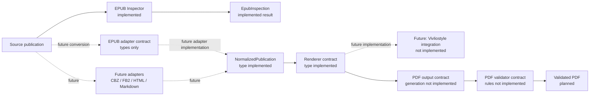
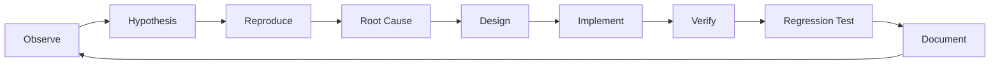

# ReflowPress

## What is ReflowPress?

ReflowPress is a local-first project for preparing electronic books and
documents for reliable PDF workflows. The repository has completed bootstrap
stabilization and implements the **Phase 1 EPUB Inspector**. It reads an EPUB's
ZIP container and OPF structure and returns structured inspection data. EPUB
content normalization, PDF conversion, rendering, validation, and GUI features
remain unimplemented.

## Why ReflowPress?

Electronic books can render differently across readers and may be difficult to
use in document workflows. ReflowPress is designed around a repeatable
conversion pipeline and a test feedback loop, so output quality and
regressions can be checked. The project also demonstrates TypeScript,
Playwright, automated testing, and QA design.

## Architecture

The solid inspection path is implemented. The separate conversion path remains
planned; type-level contracts are labeled separately from implementations.



See [the architecture and package dependency graphs](docs/architecture.md) and
[all diagram notes](docs/diagrams/README.md).

The package API can inspect a local EPUB archive:

```ts
import { inspectEpub } from "@reflowpress/epub";

const inspection = await inspectEpub("./book.epub");
```

The result contains the OPF path, available Dublin Core metadata, manifest
items, and spine order. Inspection does not extract files or produce a PDF.

## Development Loop

This loop applies to incidents, bug fixes, features, test improvements, and
quality improvements.



Read the full procedure in [docs/development-loop.md](docs/development-loop.md).

## Quality Strategy

The project tests EPUB inspection with generated ZIP fixtures, including
malformed input, missing references, unsafe paths, and configured size/count
limits. PDF quality, visual regression, and golden master checks remain planned
until a renderer exists. See [docs/test-strategy.md](docs/test-strategy.md) for
the applied test design techniques and remaining coverage.

## Development setup

Install Node.js 22.13 or newer and pnpm 11. From the repository root:

```sh
pnpm install
pnpm lint
pnpm typecheck
pnpm test
pnpm build
```

Playwright Test is configured for `tests/e2e`, but there is no application to
launch yet. E2E tests are not required in CI until a real GUI exists.

## Roadmap

| Phase | Scope                                             | Status      |
| ----- | ------------------------------------------------- | ----------- |
| 0     | Development foundation                            | Complete    |
| 0.5   | Bootstrap stabilization and quality documentation | Complete    |
| 1     | EPUB Inspector                                    | Implemented |
| 2     | EPUB 3 to PDF CLI and output filename generation  | Planned     |
| 3     | PDF Quality Gate                                  | Planned     |
| 4     | Playwright and visual regression                  | Planned     |
| 5     | Desktop GUI                                       | Planned     |
| 6     | Additional publication formats                    | Planned     |

PDF output filename requirements for Phase 2 are recorded in
[docs/product-requirements.md](docs/product-requirements.md#pdf-output-naming-requirement-planned-for-phase-2).
