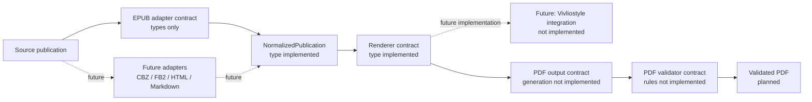
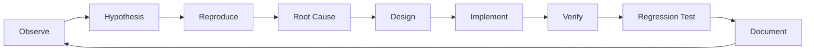

# ReflowPress

## What is ReflowPress?

ReflowPress is a planned local tool for converting electronic books and
documents into PDFs that work reliably in reading and document-analysis tools.
The repository is in **Phase 0.5: Bootstrap Stabilization**. Conversion,
rendering, validation, and GUI features are not implemented.

## Why ReflowPress?

Electronic books can render differently across readers and may be difficult to
use in document workflows. ReflowPress is designed around a repeatable
conversion pipeline and a test feedback loop, so output quality and
regressions can be checked. The project also demonstrates TypeScript,
Playwright, automated testing, and QA design.

## Architecture

This diagram shows the planned pipeline. Solid package names have type-level
contracts; the dashed paths and conversion implementations are future work.



See [the architecture and package dependency graphs](docs/architecture.md) and
[all diagram notes](docs/diagrams/README.md).

## Development Loop

This loop applies to incidents, bug fixes, features, test improvements, and
quality improvements.



Read the full procedure in [docs/development-loop.md](docs/development-loop.md).

## Quality Strategy

The project uses small contract tests now and plans integration, end-to-end,
PDF quality, visual regression, and golden master checks as implementations
arrive. The test strategy names JSTQB Foundation Level design techniques and
marks which ones have not yet been applied. See
[docs/test-strategy.md](docs/test-strategy.md).

## Development setup

Install Node.js 22.13 or newer and pnpm 11. From the repository root:

```sh
pnpm install
pnpm lint
pnpm typecheck
pnpm test
pnpm build
```

Playwright Test is configured for `tests/e2e`, but there is no application to
launch yet. E2E tests are not required in CI until a real GUI exists.

## Roadmap

| Phase | Scope                                             |
| ----- | ------------------------------------------------- |
| 0     | Development foundation                            |
| 0.5   | Bootstrap stabilization and quality documentation |
| 1     | EPUB Inspector                                    |
| 2     | EPUB 3 to PDF CLI                                 |
| 3     | PDF Quality Gate                                  |
| 4     | Playwright and visual regression                  |
| 5     | Desktop GUI                                       |
| 6     | Additional publication formats                    |
