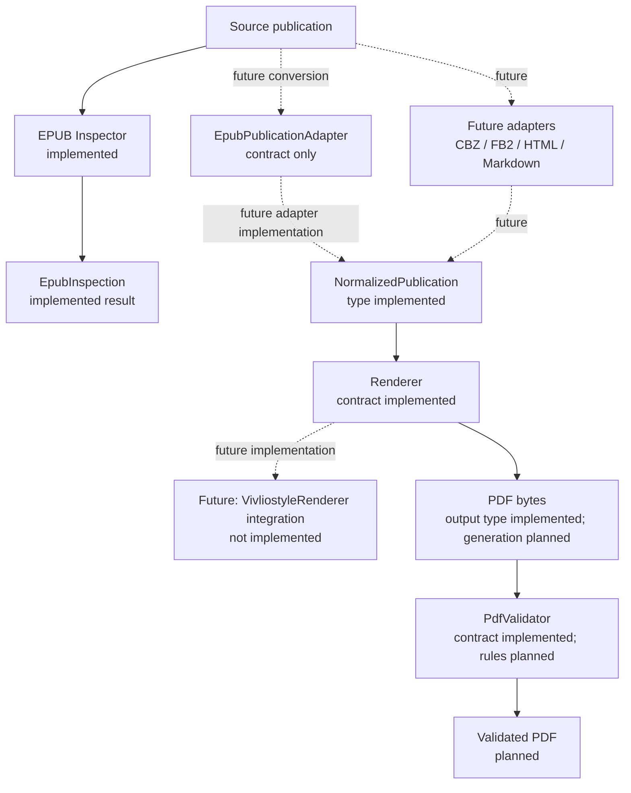
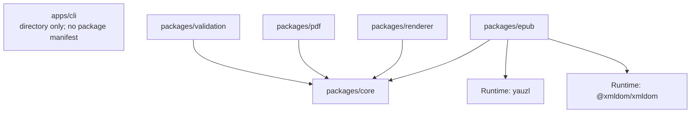
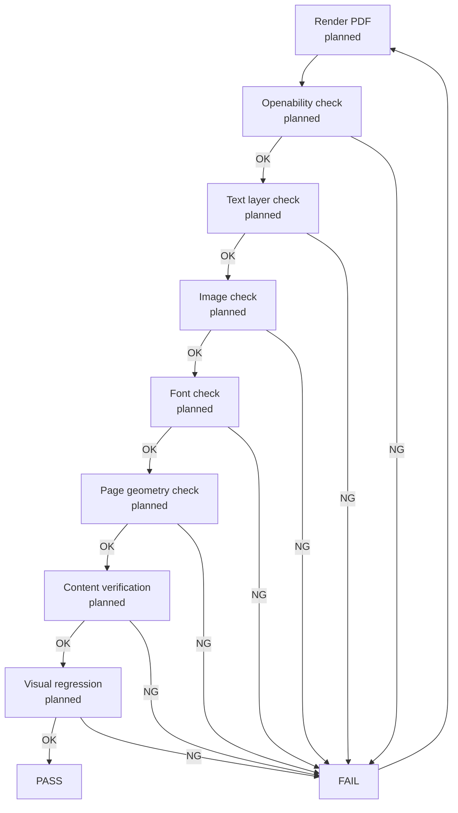

# Architecture

## EPUB inspection and planned publication pipeline

The graph describes the intended conversion boundary. Existing TypeScript
contracts are labeled separately from implementations that are still
planned.

`packages/core` owns the format-neutral model and adapter/renderer contracts.
It has no UI dependency. `packages/epub` inspects ZIP entries, `container.xml`,
and OPF metadata/manifest/spine and returns the package-specific
`EpubInspection`; its separate `EpubPublicationAdapter` remains a contract and
does not yet produce `NormalizedPublication`. `packages/renderer` defines
renderer contracts, including a type-level Vivliostyle contract, but does not
launch Vivliostyle. `packages/pdf` re-exports the shared PDF output type.
`packages/validation` defines the validator contract without inspecting PDF
files.

## Package dependency graph

The graph below follows package manifest dependencies. Arrows point from a
package to a package it depends on; workspace and runtime dependencies are
shown.

`pnpm-workspace.yaml` includes `apps/*` and `packages/*`. External ZIP/XML
libraries are runtime dependencies of `packages/epub`; they are not workspace
packages. At this stage,
`apps/cli` contains documentation only, so it declares no package dependencies
and has no graph edges. The four workspace dependency edges above are declared
in their respective manifests. There are no package dependency cycles. TypeScript
project references also point from each of those packages to `packages/core`.

The Inspector uses [yauzl](https://github.com/thejoshwolfe/yauzl) for
asynchronous, file-based ZIP central-directory reading with lazy entry handling
and size validation; it reads only the two metadata documents and does not
extract entries. It uses [@xmldom/xmldom](https://github.com/xmldom/xmldom)
for XML parsing, with DTD declarations rejected before parsing. The
container and OPF documents default to a 4 MiB limit; the archive is limited to
128 MiB and 20,000 entries. These caps bound DOM memory and metadata parsing
work. Both are pure JavaScript packages; xmldom has no runtime dependencies,
and yauzl has one small runtime dependency. `@types/yauzl` is a development-only
TypeScript declaration dependency.

The runtime dependency direction is therefore adapters and services toward
Core contracts. A future CLI can depend on these packages after it gains a
package manifest; it is not represented as an existing dependency today.

## Conversion pipeline

The first branch reads EPUB structure and returns inspection data. The separate
conversion stages remain planned; no stage currently turns publication content
into normalized markup or PDF.

```mermaid
flowchart LR
    SOURCE[Electronic book or document]
    DETECT[Format detection<br/>planned]
    LOAD[Load<br/>planned]
    PARSE[Parse with format adapter<br/>planned]
    NORMALIZE[Normalize<br/>contract exists]
    RENDER[Render<br/>contract exists]
    PDF[PDF output<br/>type exists]
    VERIFY[Quality gate<br/>planned]
    OUTPUT[Output<br/>planned]

    SOURCE --> DETECT
    DETECT --> LOAD
    LOAD --> PARSE
    PARSE --> NORMALIZE
    NORMALIZE --> RENDER
    RENDER --> PDF
    PDF --> VERIFY
    VERIFY --> OUTPUT
```

Future EPUB, CBZ, FB2, HTML, Markdown, or other format adapters will handle
their source-specific loading and parsing before producing
`NormalizedPublication`. They are planned extension points, not supported
input implementations today.

## PDF quality loop

All checks in this loop are **Planned**. Generating a PDF alone will not count
as a successful conversion once the quality gate is implemented.

Visual regression is planned for after rendering is stable and reviewed page
baselines exist. Golden master comparisons will avoid raw PDF byte comparisons
when timestamps or object ordering are nondeterministic.

## Current boundaries

- Core contracts contain no file, network, renderer, or GUI implementation.
- The EPUB package inspects archive structure and package metadata only; it
  does not extract publication content or convert it. DRM removal is out of
  scope.
- A renderer can be replaced by implementing `Renderer` without changing the
  normalized publication contract.
- The CLI and a future desktop GUI are application entry points and will use
  the same Core contracts.

See [ADR 0001](adr/0001-layered-publication-pipeline.md) for the initial
architecture decision and [the diagram index](diagrams/README.md) for the
complete graph list.
