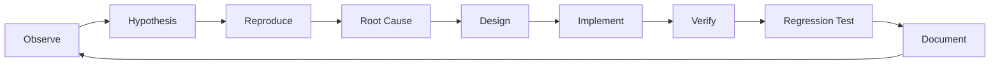

# Development and quality loop

ReflowPress uses one development loop for incident investigation, bug fixes,
feature work, test improvements, and quality improvements. Work is complete
when the behavior has been verified, relevant regressions are covered, and the
reason for the change is documented.

## Loop stages

1. **Observe:** Record the user-visible behavior, command, error, and relevant
   environment facts.
2. **Hypothesis:** State one specific cause that could explain the observation.
3. **Reproduce:** Repeat the smallest action that distinguishes the hypothesis
   from other explanations.
4. **Root Cause:** Trace the failure to the component and condition that
   produced it. Do not change project configuration to mask an unexplained
   failure.
5. **Design:** Choose the smallest change that addresses the cause and define
   how it will be verified.
6. **Implement:** Make the change at the responsible boundary.
7. **Verify:** Run the relevant checks and inspect their results.
8. **Regression Test:** Add or update tests for the behavior and nearby failure
   conditions.
9. **Document:** Record the decision, behavior, and operational limits, then
   return to observation as new evidence arrives.

If reproduction disproves a hypothesis, return to observation and form a new
one. If verification fails, record the evidence and return to reproduction or
root-cause analysis before making another change.

## First infrastructure incident

The initial bootstrap attempt exposed both `pnpm` `_tmp_* ENOENT` and Git
`.git/HEAD.lock` errors. The same loop was applied:

| Stage           | Evidence and result                                                                                                                                                                                                                                             |
| --------------- | --------------------------------------------------------------------------------------------------------------------------------------------------------------------------------------------------------------------------------------------------------------- |
| Observe         | `pnpm install` reported `ENOENT` opening a temporary file in the repository. `git switch -c` could not create `.git/HEAD.lock`, and adding the requested `origin` could not create `.git/config.lock`.                                                          |
| Hypothesis      | A malformed pnpm setting or damaged Git metadata might be causing both failures.                                                                                                                                                                                |
| Reproduce       | Repeated `pnpm install` and script commands reproduced the pnpm error. A reversible write probe succeeded in the permitted temporary area and failed in the repository. Git could read the repository state but could not create its HEAD or config lock files. |
| Root Cause      | The active task environment permits source edits through its patch mechanism, but command processes cannot create files in the repository. The `.git` directory is explicitly read-only. Both errors are consequences of those filesystem permissions.          |
| Design          | Treat this as an execution-environment boundary. Do not change pnpm configuration, reconstruct Git metadata, or claim that project settings fixed it.                                                                                                           |
| Implement       | Record the finding here. No repository-level fix can grant the task process write access.                                                                                                                                                                       |
| Verify          | The temporary-area probe passed; repository writes, branch creation, and remote configuration remained blocked. Dependency installation and Git operations therefore remain unverified.                                                                         |
| Regression Test | Repeat installation, verification, and branch creation after running in an environment that grants command processes repository and `.git` write access.                                                                                                        |
| Document        | Keep this diagnosis with the loop so the next setup attempt starts from evidence rather than another configuration guess.                                                                                                                                       |

This incident does not show a pnpm or Git repository defect. It also does not
complete the bootstrap quality gate; run the requested commands in a writable
checkout before starting Phase 1.

## Revalidation in the Phase 0.5 checkout (2026-09-26)

The next verification was performed in a checkout with command-level write
access. Node.js 24.17.0, pnpm 11.25.0, and Git 2.53.0 were available, and the
Node.js version satisfies the project's `>=22.13.0` requirement. `pnpm install`
resolved and linked the workspace dependencies and generated the lockfile, but
returned a non-zero exit because pnpm 11 rejects the removed
`onlyBuiltDependencies` setting and requires explicit build approval. pnpm
added a placeholder for `esbuild` to `pnpm-workspace.yaml`. The repository
allows only that dependency's build script with `allowBuilds: esbuild: true`,
then `pnpm install` completed successfully and ran esbuild's postinstall.

The prior `_tmp_* ENOENT` and Git lock-file errors did not recur. Git could read
the repository, but this checkout initially had no commits, no configured
remote, and was on `master`; those Git facts are handled during finalization.
