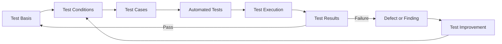

# Test strategy

Testing uses the JSTQB Foundation Level vocabulary as a practical guide for
test analysis, design, and execution. Test depth will grow with the product;
this foundation phase has only contract smoke tests.

## Test design and feedback loop

The following is the planned test process. Current contract smoke tests
exercise the shared types and do not yet apply the listed input-design
techniques.

## Test basis

- Product requirements and the current supported-format list.
- Architecture and package contracts.
- EPUB container, package document, reading order, and resource expectations
  established during the EPUB Inspector phase.
- PDF quality requirements and rendered reference outputs established when a
  renderer exists.

## Test conditions

Test conditions are observable behaviors derived from that basis. Initial
conditions include whether a source is a supported EPUB, whether it has a
usable reading order, whether referenced resources are available, whether PDF
output is structurally valid, and whether rendered pages meet stable quality
expectations.

## Test levels

- **Unit test:** fast checks for pure parsing, normalization, layout options,
  and validation rules. The foundation currently checks contract values and
  structural implementations.
- **Integration test:** verify boundaries between EPUB parsing, normalized
  publication data, renderer output, and PDF validation. Store licensed,
  minimal fixtures in `tests/fixtures` and record their provenance.
- **E2E test:** exercise user-visible CLI or GUI flows. Playwright is
  configured for future GUI projects; no dummy UI is included and these tests
  are not required in CI yet.

## Test design techniques

These techniques are part of the planned test design. The current contract
smoke tests do not use them; apply them when the EPUB Inspector and conversion
behavior provide testable conditions.

| Technique                | Planned use                                                                                                                  | Status                   |
| ------------------------ | ---------------------------------------------------------------------------------------------------------------------------- | ------------------------ |
| Equivalence Partitioning | Select representative supported EPUB 3 reflowable, EPUB 3 fixed-layout, EPUB 2, malformed, incomplete, and protected inputs. | Planned; not yet applied |
| Boundary Value Analysis  | Check zero/one spine entries, empty/minimal metadata, resource reference boundaries, and specified size limits.              | Planned; not yet applied |
| Decision Table Testing   | Combine container, OPF, spine, resource, and encryption conditions to define accept/reject results.                          | Planned; not yet applied |
| State Transition Testing | Exercise selected, inspected, normalized, rendered, validated, completed, and failed conversion states.                      | Planned; not yet applied |

- **Visual regression testing:** compare representative rendered page images
  to reviewed baselines after renderer and font changes. Baseline updates need
  review because intentional rendering changes may alter pixels.
- **Golden master testing:** retain known-good PDF or extracted page outputs
  for representative publications and compare stable properties. Avoid
  brittle byte-for-byte PDF comparisons when timestamps or object ordering
  vary; normalize or compare content and page properties instead.

## Initial EPUB test classes

| Class   | Inputs                          | Expected direction                                                   |
| ------- | ------------------------------- | -------------------------------------------------------------------- |
| Valid   | EPUB 3 Reflowable               | Accept and preserve spine order                                      |
| Valid   | EPUB 3 Fixed Layout             | Accept and retain fixed-layout metadata                              |
| Valid   | EPUB 2                          | Accept as supported legacy input and record any conversion limits    |
| Invalid | ZIP that is not an EPUB         | Reject as unsupported input                                          |
| Invalid | Corrupted ZIP                   | Reject with a useful archive error                                   |
| Invalid | Missing `container.xml`         | Reject as an incomplete EPUB container                               |
| Invalid | Missing OPF package document    | Reject as an incomplete publication                                  |
| Invalid | Missing spine                   | Reject because reading order is unavailable                          |
| Invalid | Missing referenced resource     | Reject and identify the missing item                                 |
| Invalid | Encrypted or DRM-protected EPUB | Reject or report unsupported protection; DRM removal is out of scope |

## Regression and execution

Pull requests and pushes to `main` run lint, typecheck, unit tests, and build.
Integration tests will join CI when the adapter and renderer exist. Visual
regression and golden master checks begin only when stable rendered fixtures
and reviewable baselines are available. Playwright E2E remains optional until
there is a real CLI or GUI flow to exercise.
