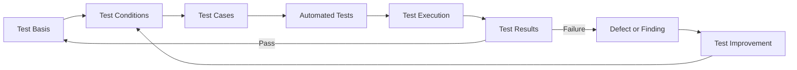

# Test strategy

Testing uses the JSTQB Foundation Level vocabulary as a practical guide for
test analysis, design, and execution. Phase 1 tests exercise actual ZIP/XML
parsing with small archives generated in code. Conversion and PDF quality
checks remain planned until those components exist.

## Test design and feedback loop

The following process applies to the Inspector tests and later phases.

## Test basis

- Product requirements and the current supported-format list.
- Architecture and package contracts.
- EPUB container, package document, reading order, and resource expectations
  established during the EPUB Inspector phase.
- PDF quality requirements and rendered reference outputs established when a
  renderer exists.

## Test conditions

Inspector conditions include whether an archive is readable and within limits,
whether its container and package documents are present and well formed,
whether paths remain inside the archive, whether manifest targets exist, and
whether spine references identify manifest entries. PDF and rendered-page
conditions remain future work.

## Test levels

- **Unit test:** contract checks and pure path/metadata behavior.
- **Inspector integration test:** generated minimal ZIP archives exercise the
  public inspector behavior across ZIP reading, XML parsing, and package
  validation. These tests live in `tests/unit` and do not retain binary
  fixtures.
- **Conversion integration test:** verify boundaries between normalized
  publication, renderer output, and PDF validation once those components exist.
  Store licensed minimal fixtures in `tests/fixtures` and record provenance.
- **E2E test:** exercise user-visible CLI or GUI flows. Playwright is
  configured for future GUI projects; no dummy UI is included and these tests
  are not required in CI yet.

## Test design techniques

| Technique                | Applied use                                                                                                     | Status                    |
| ------------------------ | --------------------------------------------------------------------------------------------------------------- | ------------------------- |
| Equivalence Partitioning | Valid minimal EPUB, broken ZIP, missing container/package, malformed XML, and present/missing manifest targets. | Applied to Inspector      |
| Boundary Value Analysis  | Configured archive byte/count/XML limits, absent optional metadata, and zero/one spine entries.                 | Applied to Inspector      |
| Decision Table Testing   | Archive → container → package → manifest target conditions determine the result or error classification.        | Applied across test cases |
| Error guessing           | DTD declarations, unsafe ZIP entries, and package/manifest paths escaping the archive.                          | Applied to Inspector      |
| State Transition Testing | Selected, inspected, normalized, rendered, validated, completed, and failed conversion states.                  | Planned for conversion    |

- **Visual regression testing:** compare representative rendered page images
  to reviewed baselines after renderer and font changes. Baseline updates need
  review because intentional rendering changes may alter pixels.
- **Golden master testing:** retain known-good PDF or extracted page outputs
  for representative publications and compare stable properties. Avoid
  brittle byte-for-byte PDF comparisons when timestamps or object ordering
  vary; normalize or compare content and page properties instead.

## EPUB Inspector test classes

| Class   | Inputs                                                         | Expected direction                                                   |
| ------- | -------------------------------------------------------------- | -------------------------------------------------------------------- |
| Valid   | Minimal EPUB ZIP with OPF metadata, manifest, and spine        | Return package path and preserve metadata, manifest, and spine order |
| Valid   | Optional metadata elements absent                              | Keep absent scalar values undefined and return an empty creator list |
| Invalid | Non-ZIP or malformed ZIP                                       | `INVALID_EPUB_ARCHIVE`                                               |
| Invalid | Missing `META-INF/container.xml`                               | `CONTAINER_XML_NOT_FOUND`                                            |
| Invalid | Malformed or unsafe `container.xml`                            | `INVALID_CONTAINER_XML`                                              |
| Invalid | Missing referenced OPF package document                        | `PACKAGE_DOCUMENT_NOT_FOUND`                                         |
| Invalid | Malformed or structurally incomplete OPF                       | `INVALID_PACKAGE_DOCUMENT`                                           |
| Invalid | Manifest resource absent from the ZIP                          | `MANIFEST_REFERENCE_NOT_FOUND`                                       |
| Invalid | ZIP entry or package reference escapes archive root            | Reject with archive/container/package error classification           |
| Invalid | Archive, entry count, or metadata XML exceeds configured limit | Reject before retaining oversized content                            |

The Inspector reports EPUB structure only. EPUB version compatibility,
renderability, DRM detection, and conversion acceptance are outside this
phase; DRM removal remains out of scope.

## Regression and execution

Pull requests and pushes to `main` run lint, typecheck, unit tests, and build.
Inspector tests run with the unit suite. Visual regression and golden master
checks begin only when stable rendered fixtures and reviewable baselines are
available. Playwright E2E remains optional until there is a real CLI or GUI
flow to exercise.
